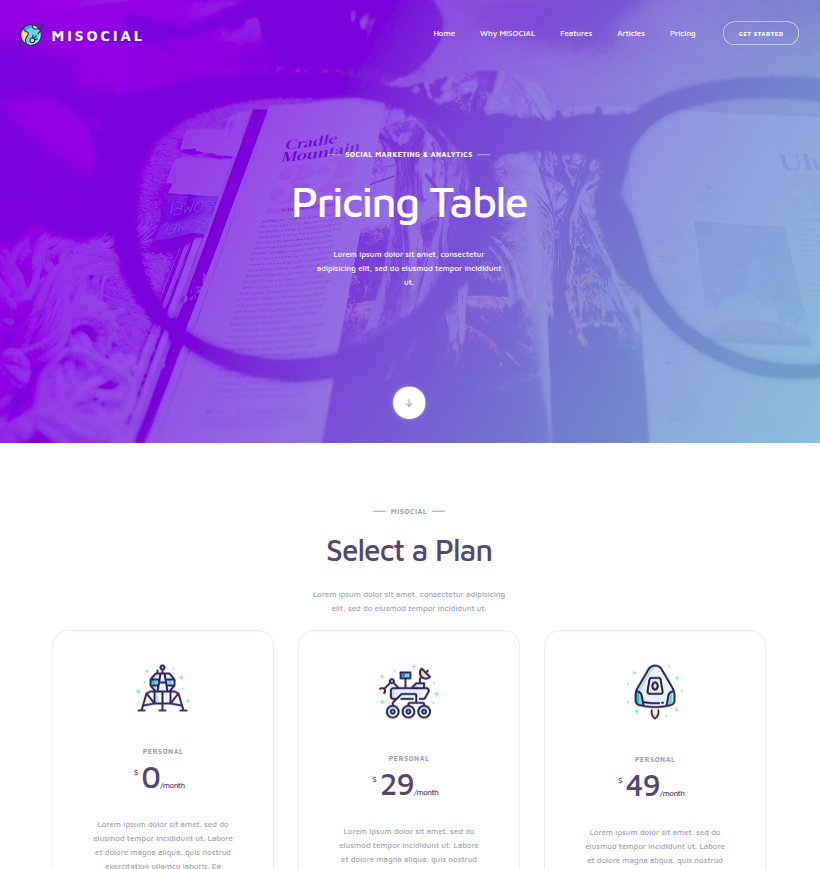

# MISOCIAL SITE

A website created to improve my skills.

## Description
This project was made to revisit the basics of preprecessors.  
The site is made for Misocial.

## Screenshots

## Technologies Used
- Pug
- Sass

## How to Run

Visit the site here: <a href="https://taras-bilyk.github.io/misocial/#main">https://taras-bilyk.github.io/misocial/#main/</a>

## Project Structure
- `docs/` — simple HTML version
- `src/` — Pug + Sass version

## Project Goal
To practice web development fundamentals, layout structure, and repository setup.

---

